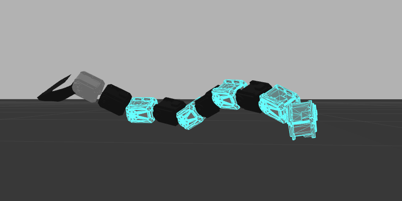

# SnakeBot

This repo contains a ROS package of our teleoperable snake robot. 
This is the final project submission for the course ENPM662. Refer the presentation for full details on implementation and various gait capabiities of the snake robot.

### CAD model:

## Contributions:
#### Pratik Acharya - CAD modelling and Inverse Kinematics  
#### Gokul Hari - Urdf parsing and building for publishers teleoperating various gait configurations.

## FUTURE IMPROVEMENTS:

## - Test the gait motions in various terrains 
## - Configure inverse kinematics with a more fancier URDF model.

### Video link:
https://youtube.com/playlist?list=PLsIA03N2vPMyx31URD8VzuKjTwSefkgqa

This is a part of the course ENPM662 Robot Modelling
